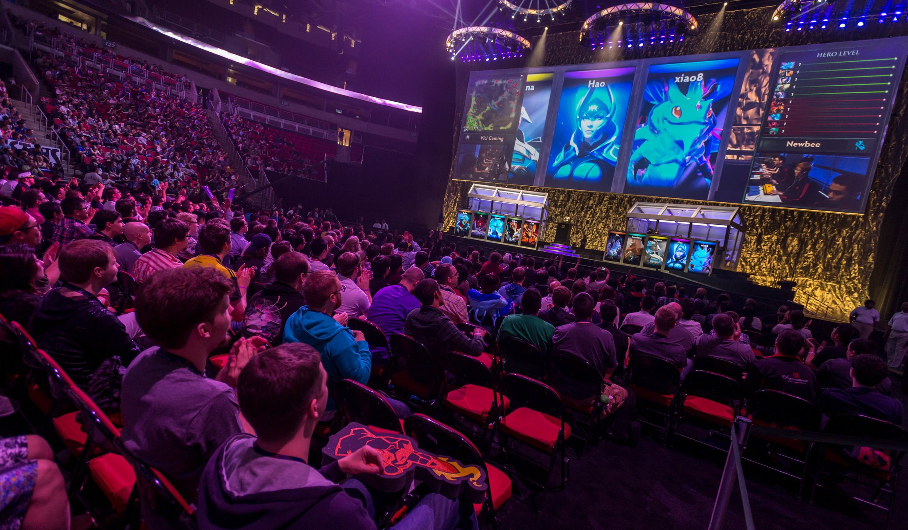
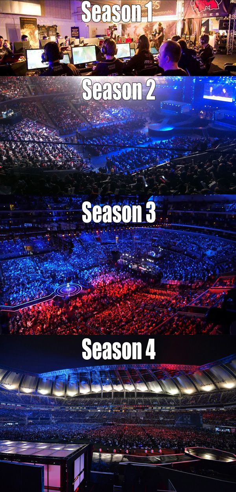

### [HOME](index)

## Professional Gaming
---
The topic that I decided to talk about is professional gaming. Today, professional gaming can be considered a very competitive sport. By sport I mean an electronic sport. I choose this topic because I enjoy playing video games and without computer technology professional gaming would not exist. Technology is at a point where a simple pass time is now able to generate billions of dollars. However, as much as I like to play videos games I am no where near as good as those who are professional gamers. Here is an image to show how big the professional gaming world has gotten.

However, the professional gaming world was never like this. Below you will be able to see throughout the years how the professional gaming has evolved.

I hope my topic was able to interest you to the world of gaming and do some research yourself about the subject. Just before I end this I would like to leave some food for thought. Though gaming may be very competitive, people make a living off just gaming and just like any sport they get paid.
